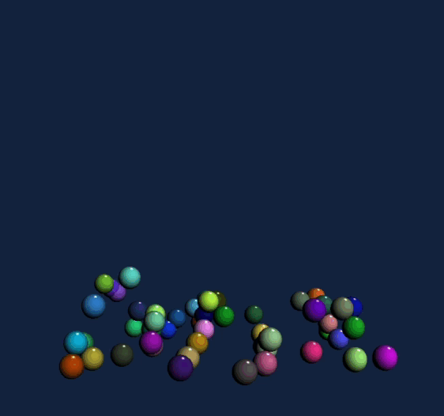

# 3D Animation Generator
## Description
This is a 3D Animation Generator in HTML/JavaScript using WebGL.
There are 4 sections: 2D Dancing Logo, Terrain, Sphere, and Torus, Moving Terrain, and Bursting Balls.

---
## 2D Dancing Logo
Technically this is not 3D animation. It allows users to create UIUC logo with different animation, such as moving, rotating, stretching, and mouse response. Additional options incldues a stick man walking and color pulsing patterns.

---
## Terrain, Sphere, and Torus
- Generate terrain according to user input of grid size, num of fractures, specular lighting, color, spheroidal weathering, etc.
- Generate a UV-sphere according to user input of num of latitube rings and longitude slices.
- Generate a icosphere according to user input of level of subdivision
- Generate a torus according to user input of major radius, minor radius, num of rings, and points per ring.

---
## Moving Terrain
Manipulate the texture mapped terrain with keyboard.

---
## Bursting Balls
Presenting 50 randomly generated balls bouncing inside an invisible box and losing velocity.
