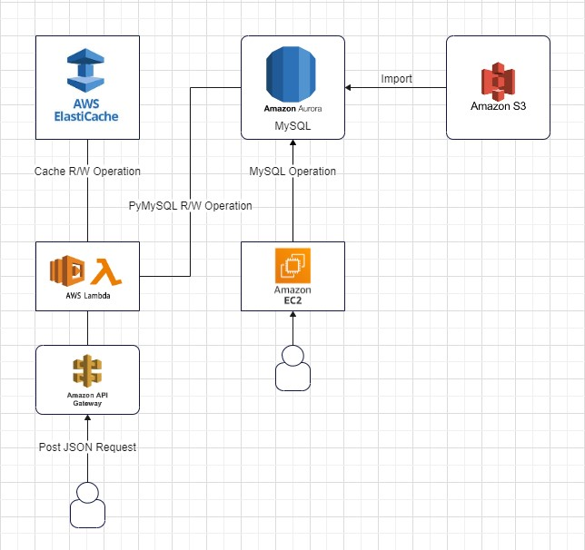

# AWS Storage Service

## Table of Contents
1. [Overview](#overview)
2. [Requirements](#requirements)
3. [Setup Instructions](#setup-instructions)
   - [Amazon S3 Setup](#amazon-s3-setup)
   - [Amazon Aurora Setup](#amazon-aurora-setup)
   - [Redis Cluster Creation](#redis-cluster-creation)
4. [Lambda Function Implementation](#lambda-function-implementation)
5. [API Setup](#api-setup)

## 1. Overview
This project involves exploring AWS RDS, ElastiCache, and S3, demonstrating how ElastiCache can enhance RDS performance. You will construct a storage service for managing read and write queries on data stored in a relational database using AWS services. The performance benefits of caching will be highlighted through this exercise.

## 2. Requirements
- A valid AWS account.
- Knowledge of Lambda, API Gateway, RDS, ElastiCache, S3.
- Proficiency in one of the programming languages: Python, JavaScript, Java, or Go.

**Note:**
- Ensure all services run in the `us-east-1` region.

## 3. Setup Instructions

### 3.1 Amazon S3 Setup
1. Create an S3 bucket and upload `mp6input.csv`.
2. Set up as per the Amazon S3 getting started guide.

### 3.2 Amazon Aurora Setup
1. Create an IAM policy and role for Amazon Aurora for S3 access.
2. Establish an Amazon Aurora database with specific settings as instructed.
3. Populate the database using data from your S3 bucket.

### 3.3 Redis Cluster Creation
- Follow the guide on creating a Redis cluster, ensuring you use a personal AWS account for this purpose.

## 4. Lambda Function Implementation
1. Set up your Lambda function using the provided template.
2. Develop Read/Write APIs, considering different caching strategies.

## 5. API Setup
- Integrate your Lambda function with an API Gateway, ensuring correct configurations. Avoid using Lambda Proxy integration for compatibility with the autograder.