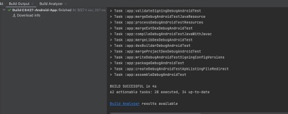
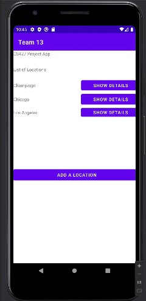
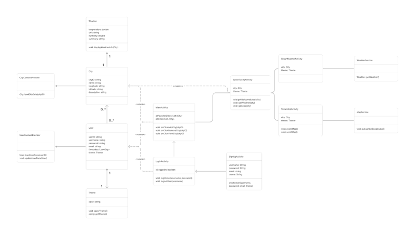
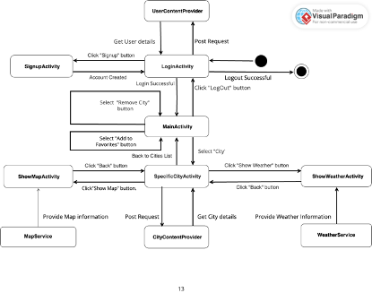

# Android App Development Project

## Overview

This project aims to enhance students' understanding and skills by having them work on an Android mobile application, to which they will add new features and subsequently validate these features to ensure they are bug-free.

## Team Formation

- Students will work in groups of 5-8.
- Each team will have a dedicated TA for guidance.

## Project Milestones

### Milestone 1: Team Making and Project Setup (10%)
- **Deadline:** October 1st
- Form your teams and set up your project environment.

#### Overview:
This initial milestone is split into two major parts: forming your team and setting up the project environment. It's crucial to meet both deadlines associated with this milestone. The first task is to respond to the CATME survey for team formation, followed by various setup tasks once teams are established.

#### Deliverables:
You are required to complete specific tasks for this milestone, including creating your team, setting up your GitHub repository, assigning team roles, and getting the CS427 app running on an Android emulator. Each team will be given a private chat room on Campuswire for communication, and you must submit a single pdf file named `Team<team-ID>-Milestone1` in this room. This file should contain:
1. Confirmation of CATME survey completion.
2. A pdf document including:
   - Link to your team's GitHub repository.
   - Screenshots confirming the successful setup of the project environment and the running app on the emulator.

#### Tasks:
##### Team Making:
- We utilize CATME for team formations. You'll receive a unique survey link via email, the results of which will be used for automated team creation. It's vital to accurately reflect your preferences in the survey as we will not adjust teams post-formation.
- Upon team assignments, we will introduce members to their dedicated chat rooms on Campuswire, where your TA and instructors will also be present.

##### Project Setup:
1. **GitHub Repository:** Establish a private GitHub repository for your team, ensuring access for all team members, your TA, and the instructors. Failure to provide access to course staff results in a substantial grade penalty.
2. **Team Roles:** In your repo's README, create and populate a table listing each team member's Name, NetID, GitHub ID, and assigned role. We identify three roles: Manager, Tech Lead, and Developer. Each team must designate one Manager and one Tech Lead, with remaining members as Developers.
3. **Weekly Meetings:** Determine a consistent time for weekly team meetings, documenting this schedule and the communication medium (e.g., Zoom) in your README. These meetings are critical for maintaining team coordination and progress, with each session requiring a documented report in a specified format.

##### Setting Up the Project Environment:
- Install Android Studio and download the CS427 app's source code.
- Configure Git for local changes and commits to your team's GitHub repository.
- Open and build the project in Android Studio, ensuring you see a "BUILD SUCCESSFUL" message. This build confirmation must be screenshot and included in your report.
- Create and configure an Android emulator, then run the app to see the CS427 app's main screen. You need to modify the app's UI to reflect your team number and provide a screenshot of this change in your deliverable.

*Detailed steps and guidelines for each task are provided in the milestone documentation.*

### Milestone 2: Requirement Engineering (20%)
- **Deadline:** October 15th
- Gather, analyze, and document the requirements for the new features.

#### Overview
In Milestone 2, teams are tasked with defining use cases and brainstorming the application design for the term project. This collaborative effort requires an understanding of the application features and the development of a formal representation of requirements and initial design. From this milestone forward, peer evaluation submissions by all team members are mandatory.

#### Deliverables
Teams must compile a PDF file named `Team<team-ID>-Milestone2` containing the following sections and submit it to the TA in the room:

1. **Informal Requirements:** Identification of at least five informal requirements for the app, following the format: “R<requirement number>: <requirement description>”.

2. **Fully Dressed Use Cases:** At least five use-case scenarios, formalized and presented in table format.

3. **Class Diagram:** A UML class diagram representing the classes needed for the application, following best practices from the course content.

4. **Component Transition Graph:** A representation of the interactions between Android components in the app's lifetime, using a UML State Machine Diagram.

Additionally, each team member must individually fill out and submit a peer evaluation form.

**Submission File:** `Team<team-ID>-Milestone2.pdf`

#### Tasks
##### App Description
The application allows users to manage a list of cities, offering detailed weather and map information for each location. Features to be implemented in later milestones include:

1. **User Login and Authentication**
2. **Manageable List of Locations**
3. **UI Customization**
4. **Live Weather Information**
5. **Accessible City Maps**

##### Requirement Engineering and Design
Based on the app description, teams should prepare the following:

- **Informal Requirements:** List and describe at least five requirements.
- **Fully Dressed Use Cases:** Identify and formalize at least five use-case scenarios.
- **Class Diagram:** Develop a UML class diagram that contemplates necessary classes for the requirements and use cases.
- **Component Transition Graph:** Illustrate the interaction between Android components using a UML State Machine Diagram.

##### Peer Evaluation
Each team member is required to complete a peer evaluation form, contributing to individual participation grades for this milestone.

### Milestone 3: Implementation, Phase 1 (25%)
- **Deadline:** October 29th
- Begin the development and complete the initial phase of feature implementation.

#### Overview:
In this phase, your team will enhance your project app by integrating new features. For consistency and assessment purposes, you are required to implement these new functionalities using the Java programming language, specifically for this project. Here's a detailed breakdown of the features you need to work on:

1. **User Login and Authentication**: Secure your app by allowing only registered users to access it.
2. **Manage List of Locations**: Give users the freedom to customize their list by adding or removing cities.
3. **UI Customization**: Make the app more engaging by offering personalized themes and layouts.

#### Deliverables:

To achieve this milestone, you need to:

1. **Update Your Team’s GitHub Repository**: Push the latest version of your code reflecting the new features.

2. **Submission of Video Demonstration**: Record and submit a video (maximum length: 5 minutes) showcasing the following functionalities in action:

   - Launching the app to display the login page.
   - Registering two users using team members' NetIDs as usernames and demonstrating UI customization.
   - User-specific list operations: adding and removing cities.
   - Persistent data across sessions: the list of cities should remain consistent before and after logging off.
   - Differentiated user experience: unique list of cities and UI for each user.

**Note**: Ensure the video clearly demonstrates every feature. Inconsistent or hard-coded demonstrations could impact your grades.

#### Tasks:

##### General Guidelines:

- **Android Components**: Incorporate new components (Activities/Services) into your app. Update the app’s manifest file accordingly.
- **Code Documentation**: Comment your code thoroughly to explain what each part of the code does.
- **Version Control**: Keep your team’s GitHub repository updated with the latest changes. Regular commits reflect individual contributions and project progress.

##### Detailed Features to Implement:

1. **User Login and Authentication**:
   - Implement a secure login system.
   - Guide users through a registration process, capturing details like username, password, and preferred layout.
   - Redirect users to the authentication page upon logging out.

2. **Adding/Removing Cities**:
   - Allow users to add new cities to their personalized list.
   - Implement a feature to remove cities from the list.
   - Save these preferences locally on the device to maintain consistency across different sessions.

3. **UI Customization**:
   - Offer different themes or layouts that users can choose from during registration.
   - Apply the selected themes consistently across the app’s UI for that specific user.

##### Peer Evaluation:

- It's crucial to ensure fair contribution from all team members. Fill out the peer evaluation form, detailing your peers' involvement in this milestone.

### Milestone 4: Implementation, Phase 2 (25%)
- **Deadline:** November 12th
- Complete the final phase of feature implementation.

### Milestone 5: Validation and Testing (20%)
- **Deadline:** December 3rd
- Validate and test the new features ensuring they are bug-free.

_Detailed guidelines for each milestone will be provided in individual milestone descriptions._

## Weekly Meetings and Reports

Teams must meet weekly to discuss progress, challenges, and next steps. After each meeting, a report summarizing the discussion must be submitted. A template for these reports will be provided.

## Peer and TA Evaluations

At the end of each milestone, students are required to evaluate their team members and the head TA using a provided form. This evaluation will influence the individual scores for the project, ensuring that all contributions are recognized fairly.

## Important Lectures

Two pivotal lectures will be provided to assist with your project:
- **Week 5:** Android Development
- **Week 8:** Testing

_It's crucial to attend or review these sessions as they contain valuable information that will benefit your project work._

## Deliverables

All project deliverables are to be submitted to your dedicated TA by the end of each milestone. TAs may request additional meetings for clarity or further grading specifics.

## Grading

Each team member will typically receive the same score, adjusted only if peer evaluations significantly differ. The goal is to ensure fair recognition of each student's contribution.

## Note

Success in this project reflects your ability to apply theoretical knowledge in a practical scenario, showcasing your development skills and understanding of software engineering principles. Best of luck to all teams!
