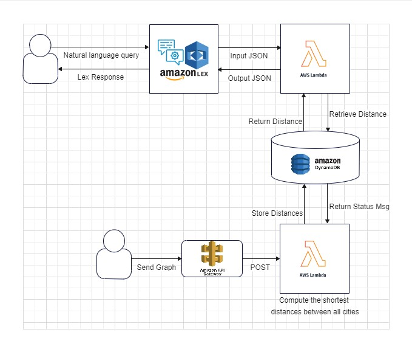

# City Distance Calculating Chatbot


## Table of Contents
1. [Overview](#overview)
2. [Requirements](#requirements)
3. [Procedure](#procedure)
    - [3.1 AWS Graph Creator Lambda Function](#31-aws-graph-creator-lambda-function)
    - [3.2 AWS Lex](#32-aws-lex)
    - [3.3 Lex with Lambda](#33-lex-with-lambda)
    - [3.4 Deploying Lex](#34-deploying-lex)

## Overview
This project involves creating a chatbot using AWS Lex and Lambda that calculates the shortest distance between two cities/nodes in a directed graph. All edges in the graph have a weight of 1. The bot will communicate the shortest path distance calculated using Breadth-First Search (BFS).

## Requirements
* AWS account
* Knowledge of AWS services: Lambda, API Gateway, DynamoDB, Cognito, Lex
* Programming capability in one of the following languages: Python, JavaScript, Java, or Go (Python recommended)
* All AWS services should be created in the `us-east-1` region

## Procedure

### 3.1 AWS Graph Creator Lambda Function
1. Implement a Lambda function that accepts a graph specification via a POST request and stores it in a DynamoDB table.
2. Use BFS to calculate the shortest distance between all pairs of nodes in the graph.
3. Return HTTP 200 upon successful execution.

**Graph specification example:** 
```json
{"graph": "Chicago->Urbana,Urbana->Springfield,Chicago->Lafayette"}
```

**DynamoDB Table Schema:**
- Source (String)
- Destination (String)
- Distance (Number)

Resources for this section:
- [Getting started with AWS Lambda](https://docs.aws.amazon.com/lambda/latest/dg/getting-started.html)
- [Creating REST APIs with AWS API Gateway](https://docs.aws.amazon.com/apigateway/latest/developerguide/rest-api-develop.html)
- [AWS SDK for Python (Boto3) Quickstart](https://boto3.amazonaws.com/v1/documentation/api/latest/guide/quickstart.html)

### 3.2 AWS Lex
Create a Lex chatbot that interprets the input for city names and responds with the shortest distance between them.

**Sample interaction:**
```
User: "What is the distance from Chicago to Springfield?"
Chatbot: "2"
```

**Configuration:**
- Use `AMAZON.US_CITY` for slot types.
- Provide suitable utterances as per the examples above.
- Remember to give your bot an alias after building.

Resources for this section:
- [Amazon Lex Getting Started](https://docs.aws.amazon.com/lex/latest/dg/ex1-sch-appt.html)

### 3.3 Lex with Lambda
Link your Lex bot with a Lambda function to fetch distance data from DynamoDB based on user input.

**Key Points:**
- Trigger the Lambda function upon user input in Lex.
- The function fetches the relevant distance from DynamoDB and returns this information to Lex.

Resources for this section:
- [AWS Lex to Lambda Input/Output Format](https://docs.aws.amazon.com/lex/latest/dg/lambda-input-response-format.html)

### 3.4 Deploying Lex
Make your chatbot accessible by deploying it using AWS Cognito Identity Pool. 

**Steps:**
- Set up an identity pool.
- Configure access permissions.
- Take note of your identity pool ID.

Resources for this section:
- [Engaging Web Users with Amazon Lex](https://aws.amazon.com/blogs/machine-learning/greetings-visitor-engage-your-web-users-with-amazon-lex/)