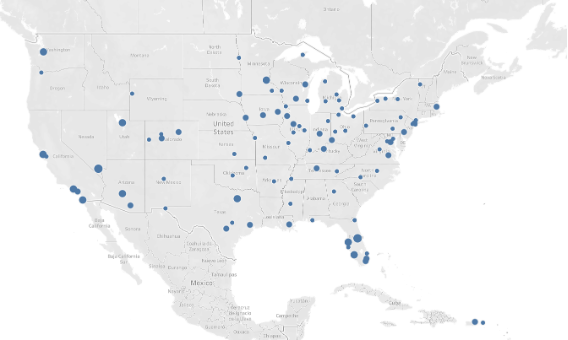
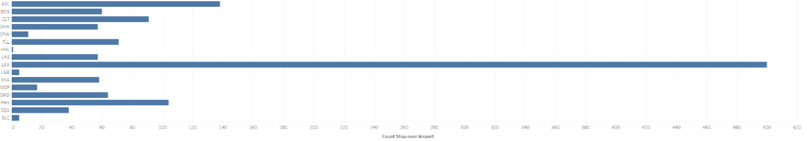
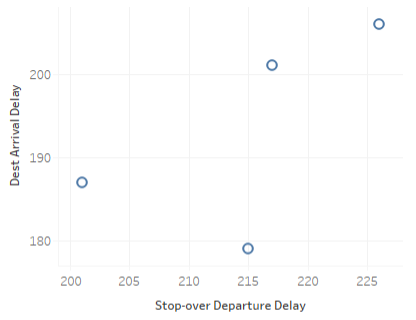

# Data Analytics & Visualization

## Table of Contents
1. [Overview](#overview)
2. [Prerequisites](#prerequisites)
3. [Procedure](#procedure)
    - [Data Preparation](#data-preparation)
    - [ETL with AWS Glue](#etl-with-aws-glue)
    - [Data Querying with AWS Athena](#data-querying-with-aws-athena)
    - [Data Visualization with Tableau](#data-visualization-with-tableau)

## Overview

In this project, you are provided with an airlines dataset. Your task is to extract, transform, and load (ETL) this data using AWS Glue, run SQL queries on the transformed data using AWS Athena, and then create meaningful visualizations with Tableau.

## Prerequisites

- AWS account (ensure AWS Athena and Glue are available)
- Tableau software installed on your local machine
- Basic knowledge of SQL
- Set up your AWS resources in the `us-east-1` region

## Procedure

### 1. Data Preparation

Download the `flights-dataset.zip` file and upload its CSV contents to your AWS S3 bucket. If you are new to S3, refer to the [S3 Create a bucket tutorial](https://aws.amazon.com/getting-started/hands-on/backup-files-to-amazon-s3/).

### 2. ETL with AWS Glue

Set up a crawler in AWS Glue to read the data from your S3 bucket and populate the Glue Data Catalog. For detailed instructions, read the AWS documentation on [adding a crawler](https://docs.aws.amazon.com/glue/latest/ug/tutorial-add-crawler.html), [AWS Glue Terminology](https://docs.aws.amazon.com/glue/latest/dg/components-key-concepts.html), and [Glue Data Catalog workflow](https://docs.aws.amazon.com/glue/latest/dg/populate-data-catalog.html).

After setting up your database and table in AWS Glue, create and run an ETL job in Glue Studio to clean and transform your data. Reference for creating a job is found [here](https://docs.aws.amazon.com/glue/latest/ug/tutorial-create-job.html).

### 3. Data Querying with AWS Athena

Use AWS Athena to run SQL queries on your dataset stored in AWS. Verify the integrity of your data by running aggregate functions.

#### Query Requirements

You will write specific SQL queries based on the requirements outlined in the project description. This includes filtering flights based on time schedules and generating results based on certain conditions.

Refer to the [Athena SQL reference](https://docs.aws.amazon.com/athena/latest/ug/ddl-sql-reference.html) for help with writing your queries.

### 4. Data Visualization with Tableau

After querying the data, you will use Tableau to create visual representations.

#### Visualization Tasks

1. Connect Tableau to your CSV files obtained from Athena queries.
2. Create visualizations as specified in the assignment instructions.
3. Export your data and visualizations in the specified formats.

Make sure you have a Tableau account; you can get a free license through [Tableau for Students](https://www.tableau.com/academic/students) if you provide your university email address.

## Resources

- [What is AWS Athena](https://docs.aws.amazon.com/athena/latest/ug/what-is.html)
- [Tableau Tutorial Video](https://www.youtube.com/watch?v=1JNhR6utYvk) (first 30 minutes)

